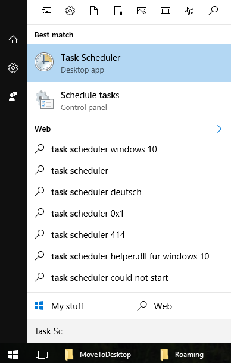
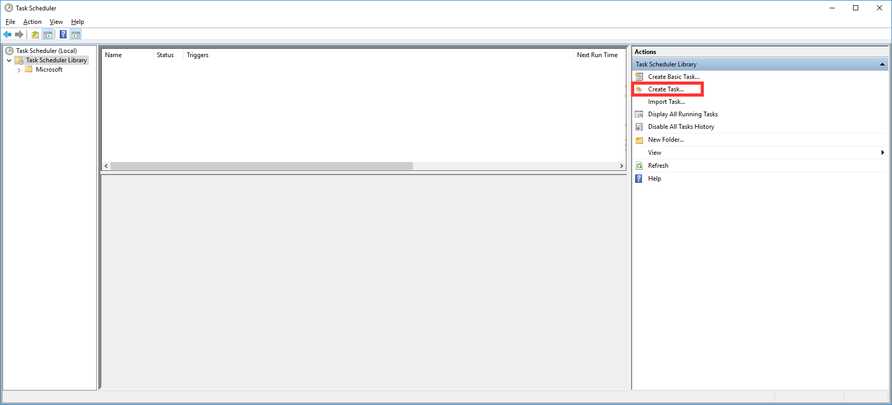
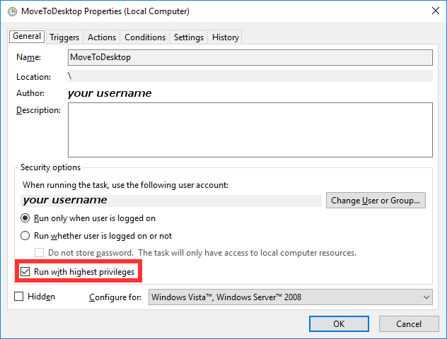
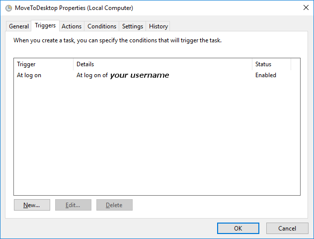
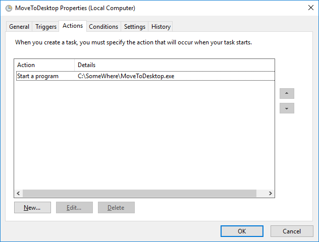

MoveToDesktop - Creating a Scheduled Task
=========================================

Open the `Task Scheduler`  

Click on `Create Task...`  

Make sure you check `Run with highest privileges`  
  

Trigger on logon  

Start MoveToDesktop  

